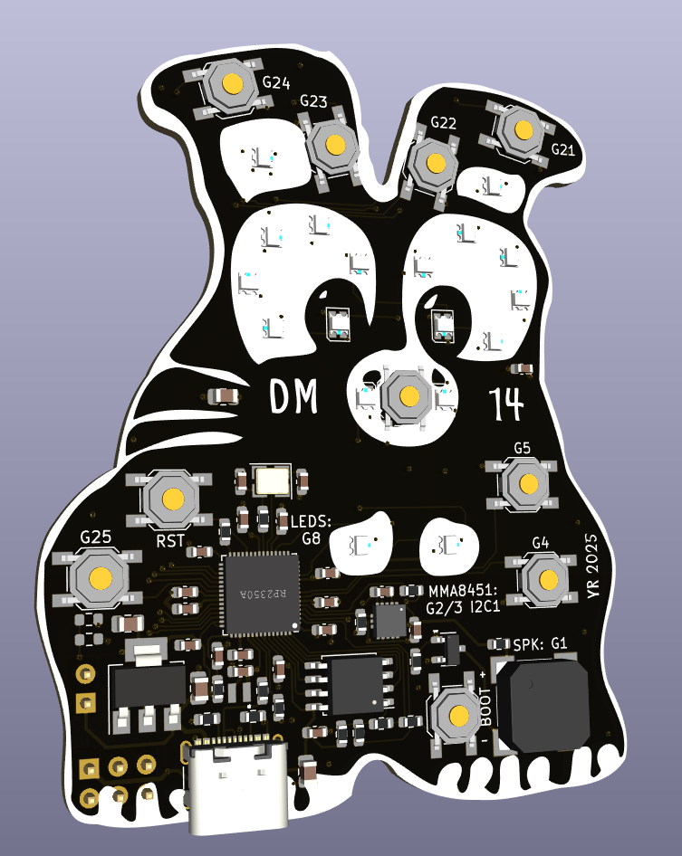

## DM 14 Wipf

### Requirements:

* [Circuitpython](https://circuitpython.org/board/raspberry_pi_pico2/)
* Circuitpython [library bundle](https://circuitpython.org/libraries)

### Features
* RP2350 (Raspberry pi pico 2)
* 16MB Flash
* 520kB ram
* Dual core ARM + RiscV
* FS USB

#### Functions
* 18 WS2812 leds: GP8
* [MMA8451](https://www.lcsc.com/product-detail/C118083.html) Accelerometer : I2C GP 2/3
* [Buzzer](https://www.lcsc.com/product-detail/C18623826.html) (Beep,Boop,Snuff) : GP1
* 8 Buttons
* [Circuitpython](https://docs.circuitpython.org/en/latest/README.html)

#### Demoprogram
* HID Clonk keyboard mode
* Accelerometer demo
* Buzzer demo
* Disco lights
* Async python